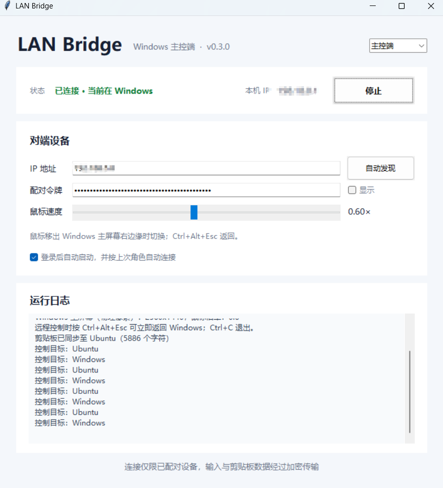

# LAN Bridge
[English Document](./README.en.md)

LAN Bridge 是面向 Windows 11 + Ubuntu 24.04 LTS 的局域网工具，实现跨设备键鼠无缝共享、双向文本剪贴板同步、局域网文件传输。

## 核心交互逻辑
- Windows / Ubuntu 可自由切换主控端、接收端角色
- Windows 主控：鼠标滑出屏幕右边缘，键鼠自动转发至 Ubuntu
- 返回 Windows：鼠标左滑 Ubuntu 虚拟边缘 或 快捷键 `Ctrl+Alt+Esc`
- 两端剪贴板实时双向同步纯文本
- 网络传输安全：预共享令牌身份校验 + ChaCha20-Poly1305 加密TCP通道
- Ubuntu 使用 `/dev/uinput` 注入输入事件，完美兼容 X11 / Wayland

## 图形界面

不需要日常使用命令行：
- Windows 安装脚本会在桌面创建 `LAN Bridge` 快捷方式。
- Ubuntu 安装脚本会在应用菜单创建 `LAN Bridge` 入口。
- 两端界面均显示当前设备 IP。
- Windows 界面可切换主控/接收角色、自动发现设备、保存配对令牌、调整鼠标速度并启停连接。
- Ubuntu 接收端使用 `uinput`；Ubuntu Wayland 主控端使用 `evdev` 独占物理设备，并通过 `Ctrl+Alt+F12` 安全切换目标。
- 可选择登录后自动启动，并按上次角色、上次 IP 自动连接。
- Ubuntu 安装脚本会安装 Noto CJK 字体，界面自动选择可显示中文的字体。
- 底层命令行仍然保留，便于故障诊断

## 1. Ubuntu 24.04 安装部署
```bash
sudo apt update
sudo apt install -y python3-venv build-essential python3-dev
cd lanbridge
python3 -m venv .venv
source .venv/bin/activate
pip install -e .
chmod +x packaging/install-linux.sh
./packaging/install-linux.sh
```
> 安装权限规则后**注销并重登Ubuntu**，在应用菜单打开LAN Bridge，界面自动生成配对令牌（等同于设备密码，仅内网信任设备使用）
> 脚本自动安装依赖：`wl-clipboard`(Wayland剪贴板)、`xclip`(X11剪贴板)

## 2. Windows 11 安装部署（PowerShell）
```powershell
cd lanbridge
Set-ExecutionPolicy -Scope Process Bypass
.\packaging\install-windows.ps1
```
安装完成双击桌面快捷方式，填写Ubuntu设备IP+配对令牌即可连接；
支持UDP广播自动发现局域网Ubuntu设备，防火墙拦截时可手动填写IP。

## 防火墙端口（仅家庭/专用局域网放行，禁止公网开放）
- TCP `45831`：加密键鼠输入、剪贴板、文件传输通道
- UDP `45832`：局域网设备自动发现广播

## 当前功能限制
- Windows主控仅支持被控设备放置在主屏幕右侧单向跨屏
- Ubuntu Wayland主控会独占物理键鼠，程序退出/断线自动释放硬件
- Ubuntu接收端依赖桌面会话，无法以无桌面系统服务后台运行
- GNOME Wayland虚拟指针使用相对位移，切入时自动对齐屏幕左边缘